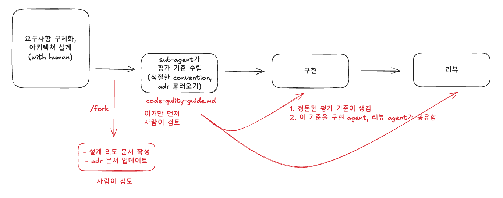

# MAFIA Code-Review harness



Claude Code 기반 코드리뷰 자동화 파이프라인.

> Git과 함께 사용할 때 가장 효과적입니다.

> 하네스와 파이프라인에 대한 자세한 설명은 [영상](https://www.youtube.com/watch?v=CfLhrS0ww5w)을 참고해주세요.

## Quick Start

1. 플러그인을 설치합니다.

   ```sh
   # claude code 실행
   claude

   # 플러그인 설치
   /plugin marketplace add vibemafiaclub/mafia-codereview-harness
   /plugin install mafia-codereview
   ```

2. `docs/code-convention.yaml`과 `docs/adr.yaml`를 복사한 뒤, 상황에 맞게 수정합니다.
3. Claude Code에서 `/mafia-codereview:auto`를 실행하세요.

## 파이프라인 흐름

```
/mafia-codereview:auto 실행
  → [1] 상태 점검 (base branch 확인)
  → [2] 설계의도 작성 (Fork)
  → [3] 평가기준 수립 (Fork + Sub-agent)
  → [4] PR 본문 생성 (Fork)
  → [5] 코드리뷰 실행 (Sub-agent, 자동)
  → [6] 리뷰 반영 + QA (Fork)
```

## Skill 목록

| 커맨드                             | 설명                            |
| ---------------------------------- | ------------------------------- |
| `/mafia-codereview:auto`           | 전체 파이프라인 오케스트레이션  |
| `/mafia-codereview:write-intent`   | 설계의도 문서 작성              |
| `/mafia-codereview:gen-criteria`   | 평가기준 자동 생성              |
| `/mafia-codereview:create-pr-body` | PR 본문 생성                    |
| `/mafia-codereview:review`         | 코드리뷰 실행                   |
| `/mafia-codereview:reflect-review` | 리뷰 반영 + QA                  |
| `/mafia-codereview:update-docs`    | code-convention / ADR 항목 관리 |

## 산출물

작업별 산출물은 `.review-artifacts/{branch-name}/`에 저장됩니다.

## License

MIT
